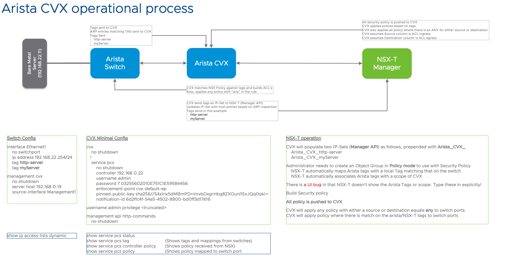

### Arista integration with NSX-T 

Quick and dirty script to configure Arista CVX to communicate with VMware NSX-T Server. This has to be configured through the API on NSX and suitable authentication configured on both ends to allow communiction to occur. 

High level steps

1) Get the SSL Thumbprint of the CVX server
2) Get the Public Key from the NSX-T server and convert to Base64 
3) Create enforcement point in NSX with CVX User/Password and CVX thumbprint
4) Extract notification id that is generated by NSX-T from Step 3 
5) Create Deployment Map in NSX, mapping security policy to CVX
6) Create Arista EOS configuration 

## Lab topology
